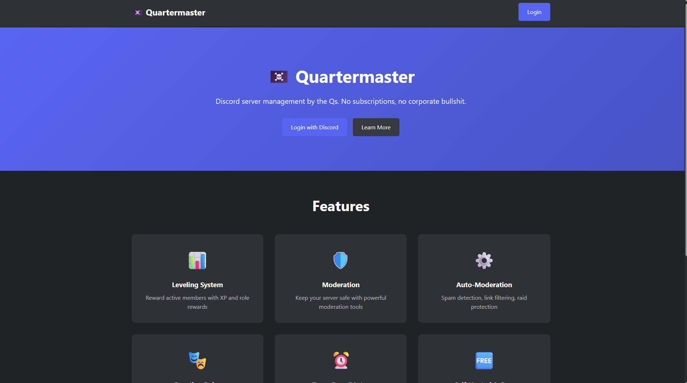
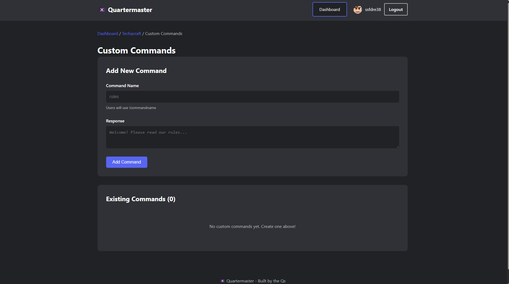

# 🏴‍☠️ Quartermaster

[](https://barrersoftware.com/foss-license.html)

## ⚠️ THIS SOFTWARE IS FREE - FOREVER

**READ THIS FIRST:**

Quartermaster is **FREE SOFTWARE** under the BarrerSoftware License (BSL).

**This means:**
- ✅ **FREE** to use, modify, and distribute
- ✅ **FREE** forever - no subscriptions, no fees, no "premium" versions
- ❌ **CANNOT BE SOLD** - not by us, not by you, not by anyone
- ❌ **NO PAID TIERS** - all features are free for everyone
- ❌ **NO COMMERCIALIZATION** - this software must remain free

**If someone is charging you for Quartermaster, they are violating the license.**

Report violations to: legal@barrersoftware.com

---

## 🎯 What is Quartermaster?

**The ONE Discord bot you need.**

Quartermaster is a complete, free, open-source Discord server management bot that replaces MEE6, Dyno, and every other paid bot service.

### ✨ Features

**Leveling & XP System**
- Customizable XP rewards
- Role rewards at level milestones
- Beautiful leaderboards
- Web dashboard for configuration

**Moderation Tools**
- Ban, kick, mute, warn
- Temporary bans with auto-unban
- Timeout management
- Warning system with history

**Auto-Moderation**
- Spam detection and prevention
- Link filtering
- Discord invite blocking
- Raid protection

**Engagement Features**
- Reaction roles
- Custom commands
- Welcome/leave messages
- Rules setup with react-to-verify

**AI Integration (FREE!)**
- Local AI chat via Ollama
- Unlimited responses
- No API costs
- Privacy-focused (runs on your server)

**Web Dashboard**
- Beautiful management interface
- Real-time statistics
- Server configuration
- User leaderboards

### 📸 Screenshots


*Dashboard overview with server stats and quick actions*


*Beautiful leaderboard showing top members*


*Easy configuration for all features*

### 💰 Cost Comparison

| Feature | MEE6 | Dyno | Quartermaster |
|---------|------|------|---------------|
| Leveling | $11.95/mo | Free (limited) | **FREE** |
| Moderation | $11.95/mo | $5/mo | **FREE** |
| Auto-mod | $11.95/mo | $5/mo | **FREE** |
| Role Rewards | $11.95/mo | $5/mo | **FREE** |
| Reaction Roles | $11.95/mo | $5/mo | **FREE** |
| AI Features | $100/mo | N/A | **FREE** |
| **Total/month** | **$90+** | **$10+** | **$0** |

---

## 🚀 Quick Start

### Prerequisites
- Node.js 18+ 
- Discord Bot Token ([Get one here](https://discord.com/developers/applications))
- (Optional) Ollama for AI features ([Install Ollama](https://ollama.ai))

### Installation

1. **Clone the repository:**
```bash
git clone https://github.com/barrersoftware/quartermaster.git
cd quartermaster
```

2. **Install dependencies:**
```bash
npm install
```

3. **Configure environment:**
```bash
cp .env.example .env
nano .env
```

Add your Discord bot token and other configuration.

4. **Start the bot:**
```bash
npm start
```

For production deployment, see [deployment/README.md](deployment/README.md)

---

## 📖 Documentation

- [Installation Guide](docs/INSTALLATION.md)
- [Configuration](docs/CONFIGURATION.md)
- [Commands Reference](docs/COMMANDS.md)
- [Web Dashboard Setup](docs/DASHBOARD.md)
- [AI Integration](docs/AI.md)
- [Deployment Guide](deployment/README.md)

---

## 🎮 Commands

**Basic usage:** `!command`

### Leveling
- `!rank` - View your rank and XP
- `!leaderboard` - Server XP leaderboard
- `!addrole <level> <@role>` - Add role reward (Manage Roles)
- `!removerole <level>` - Remove role reward (Manage Roles)
- `!rolerewards` - List all role rewards

### Moderation
- `!ban <@user> [reason]` - Ban user
- `!tempban <@user> <duration> [reason]` - Temporary ban (e.g., `24h`)
- `!kick <@user> [reason]` - Kick user
- `!mute <@user> <minutes> [reason]` - Timeout user
- `!warn <@user> [reason]` - Warn user
- `!warnings <@user>` - View user warnings
- `!clearwarnings <@user>` - Clear warnings

### Auto-Moderation
- `!automod enable <spam|links|invites>` - Enable auto-mod
- `!automod disable <spam|links|invites>` - Disable auto-mod

### Server Setup
- `!setup-rules #channel @role` - Post rules with react-to-verify
- `!setup-welcome #channel` - Create welcome embeds
- `!reactionrole <messageID> <emoji> <@role>` - Setup reaction role

### AI (Requires Ollama)
- `!ai <question>` - Ask AI anything
- `!ask <question>` - Same as !ai
- `!chat <question>` - Same as !ai

### Utility
- `!embed create` - Create custom embed
- `!validate` - View license information

---

## 🏴‍☠️ License & Philosophy

Quartermaster is released under the **BarrerSoftware License (BSL)**.

### Core Principle

**"If it's free, it's free. Period."**

This software was built to be FREE and must REMAIN FREE forever.

### Why We Built This

We watched companies like MEE6:
- Take open-source community work
- Add minimal features
- Charge $90+/month for basic functionality
- Lock features behind paywalls
- Exploit server owners who just want basic tools

**We said: NO MORE.**

Quartermaster provides EVERYTHING those paid bots do, for FREE, forever.

### License Enforcement

Quartermaster includes built-in license compliance verification to ensure it stays free:
- `!validate` command shows license information
- Automatic compliance checks prevent commercialization
- BarrerSoftware verification system protects free status

**If you find someone selling Quartermaster:**
1. It's a LICENSE VIOLATION
2. Report to: legal@barrersoftware.com
3. We will take immediate legal action

### What You CAN Do
✅ Use for any purpose  
✅ Modify and improve  
✅ Share with others  
✅ Charge for SERVICES (setup, support, training)  

### What You CANNOT Do
❌ Sell the software  
❌ Charge for access  
❌ Create paid versions  
❌ Monetize in any form  

Read the full license: [LICENSE](LICENSE)

---

## 🤝 Contributing

We welcome contributions! But remember:
- All contributions must remain under the BSL
- No paid features or premium tiers
- Keep it free for everyone

See [CONTRIBUTING.md](CONTRIBUTING.md) for guidelines.

---

## 🆘 Support

**Free Support:**
- GitHub Issues: [Report bugs or request features](https://github.com/barrersoftware/quartermaster/issues)
- Documentation: Check our docs first
- Community: Discord server (coming soon)

**This is FREE SOFTWARE. We provide free support, but we're not your 24/7 helpdesk.**

---

## 🏆 Credits

**Built by:**
- Captain CP - Lead Developer
- The Qs - Development Team

**Built with:**
- Discord.js - Discord API wrapper
- Ollama - Local AI integration
- Better-SQLite3 - Database
- Express - Web dashboard

**Built to replace:**
- MEE6 (and their $90/month fees)
- Dyno Premium
- Every other paid bot service

---

## ⚖️ Legal

Copyright (c) 2025 BarrerSoftware

This software is provided "as is" without warranty.

**Quartermaster is FREE SOFTWARE under the BarrerSoftware License.**

Not affiliated with Discord Inc., MEE6, or any other Discord bot service.

---

## 🏴‍☠️ BarrerSoftware

**Building bridges, not walls.**

**What is given freely, must remain free.**

Website: https://barrersoftware.com  
Email: legal@barrersoftware.com  
GitHub: https://github.com/barrersoftware

---

**If it's free, it's free. Period.** 🏴‍☠️
