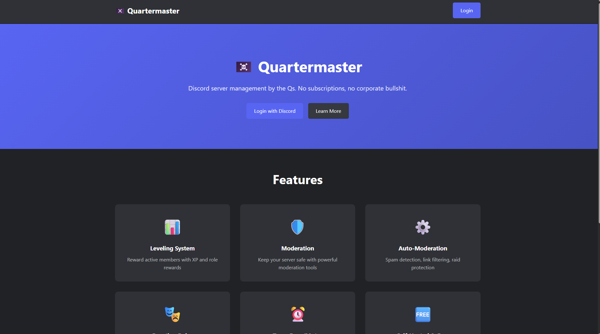
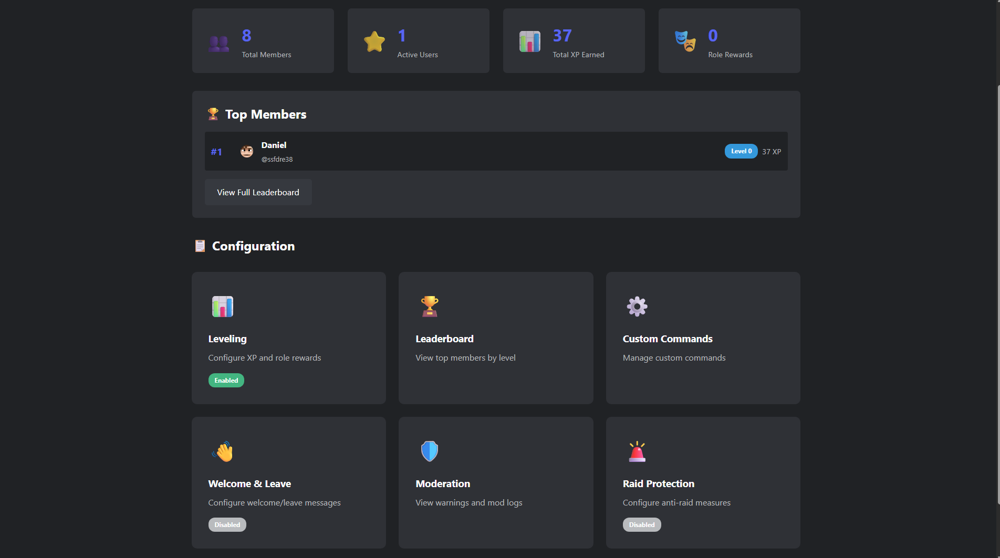
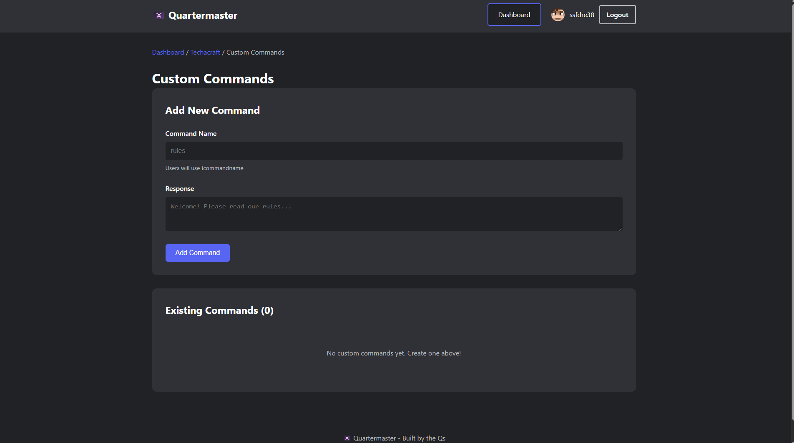

# 🏴‍☠️ Quartermaster

[](https://opensource.org/licenses/MIT)

## 🎯 What is Quartermaster?

**The ONE Discord bot you need.**

Quartermaster is a complete, free, open-source Discord server management bot that replaces MEE6, Dyno, and every other paid bot service.

### ✨ Features

**Leveling & XP System**
- Customizable XP rewards
- Role rewards at level milestones
- Beautiful leaderboards
- Web dashboard for configuration

**Moderation Tools**
- Ban, kick, mute, warn
- Temporary bans with auto-unban
- Timeout management
- Warning system with history

**Auto-Moderation**
- Spam detection and prevention
- Link filtering
- Discord invite blocking
- Raid protection

**Engagement Features**
- Reaction roles
- Custom commands
- Welcome/leave messages
- Rules setup with react-to-verify

**Web Dashboard**
- Beautiful management interface
- Real-time statistics
- Server configuration
- User leaderboards

### 📸 Screenshots


*Dashboard overview with server stats and quick actions*


*Beautiful leaderboard showing top members*


*Easy configuration for all features*

---

## 🚀 Quick Start

### Prerequisites
- Node.js 18+ 
- Discord Bot Token ([Get one here](https://discord.com/developers/applications))

### Installation

1. **Clone the repository:**
```bash
git clone https://github.com/barrersoftware/quartermaster.git
cd quartermaster
```

2. **Install dependencies:**
```bash
npm install
```

3. **Configure environment:**
```bash
cp .env.example .env
nano .env
```

Add your Discord bot token and other configuration.

4. **Start the bot:**
```bash
npm start
```

For production deployment, see [deployment/README.md](deployment/README.md)

---

## 🎮 Commands

**Basic usage:** `!command`

### Leveling
- `!rank` - View your rank and XP
- `!leaderboard` - Server XP leaderboard
- `!addrole <level> <@role>` - Add role reward (Manage Roles)
- `!removerole <level>` - Remove role reward (Manage Roles)
- `!rolerewards` - List all role rewards

### Moderation
- `!ban <@user> [reason]` - Ban user
- `!tempban <@user> <duration> [reason]` - Temporary ban (e.g., `24h`)
- `!kick <@user> [reason]` - Kick user
- `!mute <@user> <minutes> [reason]` - Timeout user
- `!warn <@user> [reason]` - Warn user
- `!warnings <@user>` - View user warnings
- `!clearwarnings <@user>` - Clear warnings

### Auto-Moderation
- `!automod enable <spam|links|invites>` - Enable auto-mod
- `!automod disable <spam|links|invites>` - Disable auto-mod

### Server Setup
- `!setup-rules #channel @role` - Post rules with react-to-verify
- `!setup-welcome #channel` - Create welcome embeds
- `!reactionrole <messageID> <emoji> <@role>` - Setup reaction role

### Utility
- `!embed create` - Create custom embed

---

## 🤝 Contributing

We welcome contributions! 

See [CONTRIBUTING.md](CONTRIBUTING.md) for guidelines.

---

## 🏆 Credits

**Built by:**
- Captain CP - Lead Developer
- The Qs - Development Team

**Built with:**
- Discord.js - Discord API wrapper
- Better-SQLite3 - Database
- Express - Web dashboard

---

## ⚖️ Legal

Copyright (c) 2025 BarrerSoftware

This software is provided "as is" without warranty.

**Quartermaster is released under the MIT License.**

Not affiliated with Discord Inc., MEE6, or any other Discord bot service.
